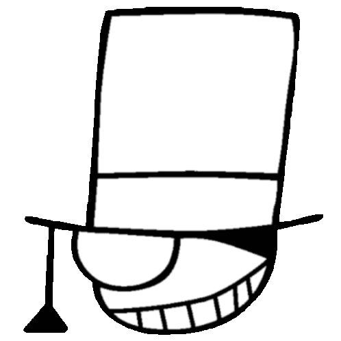

<h1 align="center">Aiko Heart</h1>

  

## 🎩 GitHub Stats

  
  

## ✨ Languages & Tools

> ## Programming Languages

   

> ## Frontend

  

> ## Backend

> ## Database

 

> ## DevOps & Cloud

> ## Tools

    

  

## 🔗 Connect with Me

 

## 💬 Quote
> “There's only one truth”

  

  

